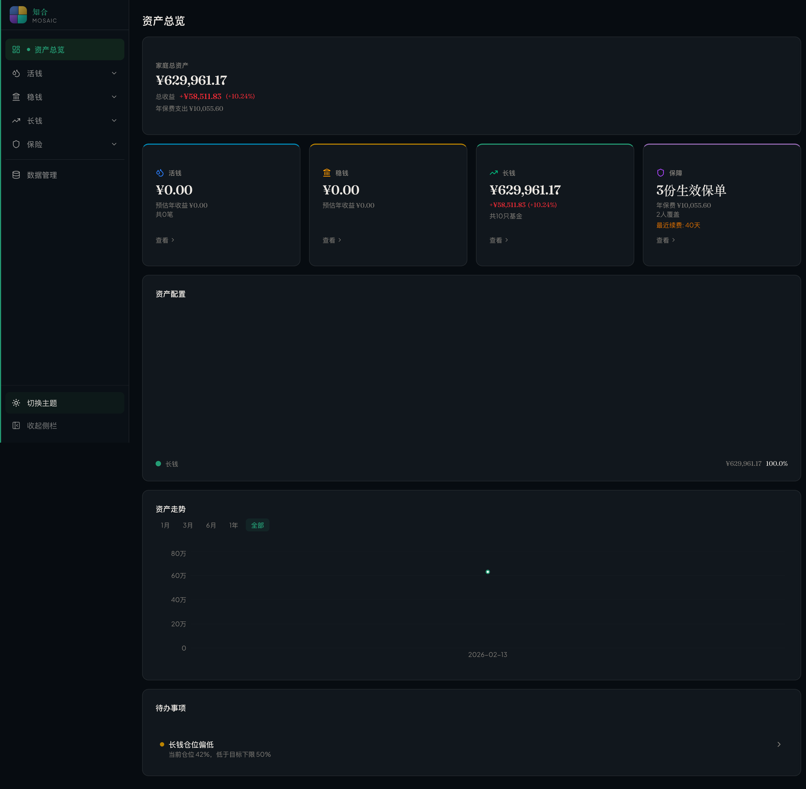
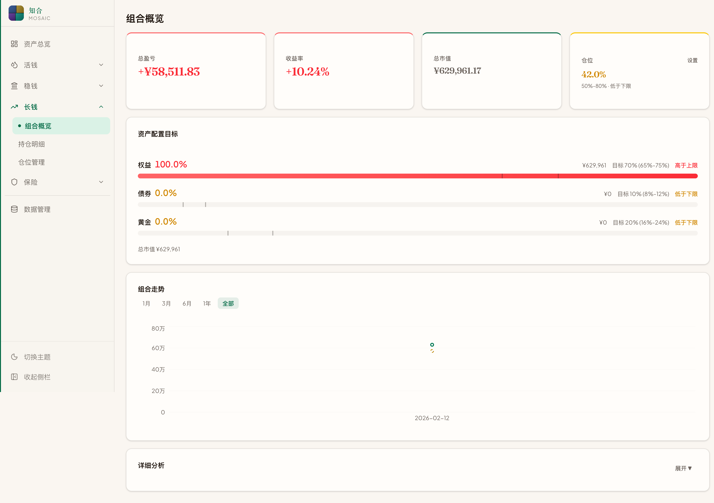
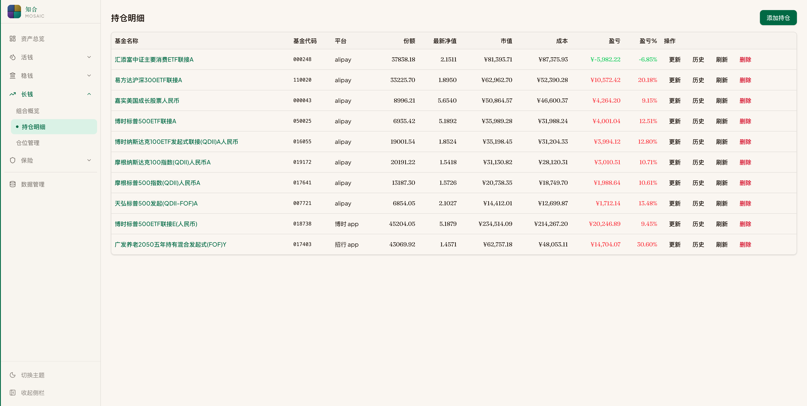
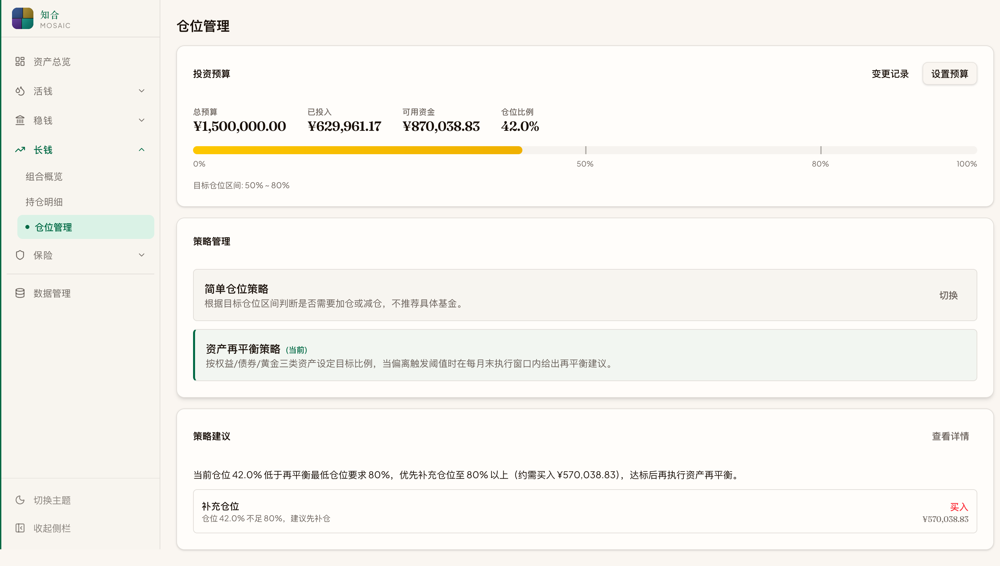
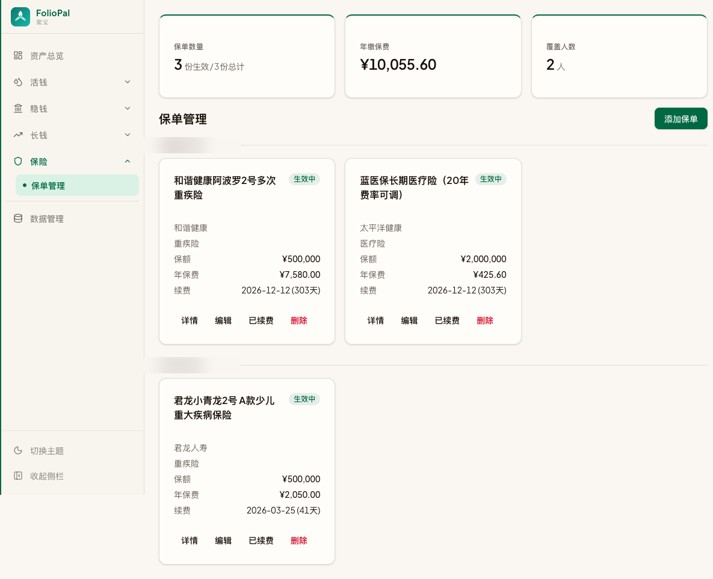
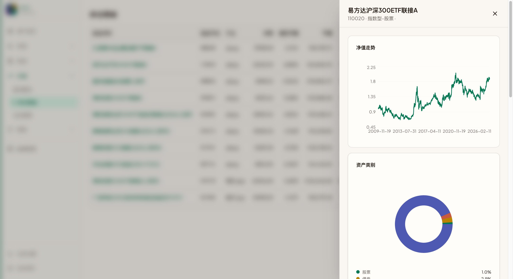

<p align="center">
  
</p>

<h1 align="center">知合 Mosaic</h1>

<p align="center">
  <strong>四笔钱框架下的家庭资产全景管理工具</strong>
</p>

<p align="center">
  <a href="#screenshots">截图</a> ·
  <a href="#features">功能</a> ·
  <a href="#architecture">架构</a> ·
  <a href="#quick-start">快速开始</a> ·
  <a href="#mcp-integration">AI 集成</a>
</p>

<p align="center">
  
  
  
  
  
</p>

---

大多数人的基金散落在支付宝、天天基金、招行、博时……各个平台。每个平台只能看到局部，看不到全貌。

**知合 Mosaic** 把所有资产拼在一起，像一幅马赛克——每一块碎片各有色彩，拼合之后才见全景。它基于「四笔钱」理念，将家庭资产分为 **活钱、稳钱、长钱、保障** 四个桶，帮你从碎片化的账户走向系统化的管理。

完全本地运行，数据只存在你自己的电脑上。

<h2 id="screenshots">Screenshots</h2>

### Dashboard — 资产总览

一屏纵览家庭资产全貌：四桶汇总卡片、资产配置环形图、走势曲线、待办提醒。

| Light | Dark |
|:---:|:---:|
|  |  |

### Growth — 基金组合

跨平台汇总基金持仓，自动拉取净值，计算盈亏。支持按资产类别/地域/行业三维度穿透分析。

| 组合概览 | 持仓明细 |
|:---:|:---:|
|  |  |

### More Pages

| 仓位管理 | 保险保单 | 基金详情面板 |
|:---:|:---:|:---:|
|  |  |  |

<h2 id="features">Features</h2>

### 四笔钱 · 四个桶

| 桶 | 管什么 | 功能 |
|---|---|---|
| **活钱** 💧 | 活期存款、货币基金 | 流动性资产台账，预估年收益 |
| **稳钱** 🏛️ | 定期存款、银行理财 | 到期提醒、利率记录 |
| **长钱** 📈 | 公募基金组合 | 净值追踪、盈亏分析、配置穿透、策略建议（见下文） |
| **保障** 🛡️ | 保险保单 | 按被保人分组、续费追踪、状态管理 |

### 基金组合深度管理

- **跨平台汇总** — 支付宝、天天基金、招行、博时……统一视图
- **自动净值更新** — 基于 [akshare](https://github.com/akfamily/akshare) 拉取中国基金市场数据，每日 20:00 定时刷新
- **三维配置穿透** — 按资产类别（股票/债券/黄金）、地域（A股/港股/美股）、行业扇区逐层拆解
- **资产配置目标** — 设定权益/债券/黄金目标比例，可视化偏离度
- **仓位管理** — 设定投资预算与目标仓位区间，实时仓位仪表盘
- **策略引擎** — 可插拔策略系统，内置两种策略：
  - *简单仓位策略* — 根据仓位区间给出加减仓建议
  - *资产再平衡策略* — 按权益/债券/黄金比例在月末窗口期触发再平衡建议
- **变更审计** — 持仓份额/成本变动全程留痕

### 智能提醒

仪表盘自动汇集待办事项并按优先级排序：

- 🔴 保险即将到期 / 已过期
- 🟡 稳钱产品即将到期
- 🟡 长钱仓位偏离目标区间
- 🔵 常规信息提示

### 设计

- **Jade & Gold 主题** — 翡翠绿 + 琥珀金配色，东方美学与现代 UI 的平衡
- **完整深色模式** — 水墨质感的暗色主题
- **衬线数字** — 金融数据使用 Fraunces / Noto Serif SC 衬线字体，编辑式排版风格
- **流畅动效** — 页面淡入、卡片悬停抬升、骨架屏加载态

<h2 id="architecture">Architecture</h2>

```
┌──────────────────────────────────────────────────────┐
│                    Frontend                          │
│  React 19 · TypeScript · Vite 7 · Tailwind CSS 4    │
│  shadcn/ui · Recharts · React Router                │
└────────────────────┬─────────────────────────────────┘
                     │ REST API (Axios)
                     ▼
┌──────────────────────────────────────────────────────┐
│                    Backend                           │
│  FastAPI · SQLModel · APScheduler                    │
│                                                      │
│  ┌─────────┐  ┌──────────┐  ┌────────────────────┐  │
│  │ Routers │  │ Services │  │ MCP Server (FastMCP)│  │
│  │ 8 groups│  │ akshare  │  │ 16 tools · 5 prompts│ │
│  └────┬────┘  └────┬─────┘  └────────────────────┘  │
│       └──────┬─────┘                                 │
│              ▼                                       │
│  ┌─────────────────────┐                             │
│  │  SQLite (14 tables) │                             │
│  └─────────────────────┘                             │
└──────────────────────────────────────────────────────┘
                     │
                     ▼ akshare
          ┌─────────────────────┐
          │  天天基金 / 东方财富  │
          │  雪球 / 基金市场数据  │
          └─────────────────────┘
```

### Tech Stack

| Layer | Technology |
|---|---|
| Frontend | React 19, TypeScript 5.9, Vite 7, Tailwind CSS 4, shadcn/ui, Recharts, Radix UI |
| Backend | Python, FastAPI, SQLModel, SQLite, APScheduler |
| Data Source | [akshare](https://github.com/akfamily/akshare) (天天基金、东方财富、雪球等) |
| AI Integration | [FastMCP](https://github.com/jlowin/fastmcp) (Model Context Protocol) |

<h2 id="quick-start">Quick Start</h2>

### Prerequisites

- Python 3.11+
- Node.js 18+
- [uv](https://github.com/astral-sh/uv) (recommended) or pip

### 1. Clone

```bash
git clone https://github.com/your-username/mosaic.git
cd mosaic
```

### 2. Backend

```bash
cd backend
uv venv && source venv/bin/activate
uv pip install -r requirements.txt
uvicorn app.main:app --reload
# → http://localhost:8000
```

### 3. Frontend

```bash
cd frontend
npm install
npm run dev
# → http://localhost:5173
```

### One-liner

```bash
./start.sh   # 同时启动前后端
```

打开浏览器访问 `http://localhost:5173`，在「持仓明细」页面添加你的第一只基金。

<h2 id="mcp-integration">AI Integration (MCP)</h2>

知合内置了一个 [Model Context Protocol](https://modelcontextprotocol.io) 服务器，可以让 AI 助手直接读取你的财务数据进行分析。

### 能力一览

| 类别 | 工具 |
|---|---|
| 组合分析 | 持仓总览、平台分布、配置穿透、历史走势 |
| 基金研究 | 基金详情、净值历史、实时估值 |
| 仓位策略 | 预算状态、策略建议 |
| 市场行情 | 主要指数（上证/深证/沪深300/恒生/纳斯达克…）、宏观指标（CPI/PMI/LPR/M2/社融） |
| 四桶资产 | 活钱/稳钱/保险的全量查询 |

### 内置 Prompt

- **周度回顾** — 本周组合表现与市场对比
- **风险检查** — 持仓集中度与配置偏离分析
- **再平衡建议** — 基于当前偏离给出调仓方案
- **宏观简报** — 近期宏观指标变化与影响
- **家庭总览** — 四笔钱全景分析

### 配置

在支持 MCP 的客户端（如 Claude Desktop、Claude Code）中添加：

```json
{
  "mcpServers": {
    "finance": {
      "command": "uv",
      "args": ["run", "--directory", "/path/to/mosaic/backend", "python", "-m", "mcp_server"]
    }
  }
}
```

## Project Structure

```
├── backend/
│   ├── app/
│   │   ├── main.py              # FastAPI entry, scheduler, CORS
│   │   ├── models.py            # 14 SQLModel tables
│   │   ├── routers/             # 8 router groups
│   │   └── services/            # Business logic + strategies
│   └── mcp_server/              # MCP server (16 tools, 5 prompts)
├── frontend/
│   └── src/
│       ├── pages/               # 8 page components
│       ├── components/          # Charts, dialogs, layout
│       ├── services/api.ts      # API client
│       └── types.ts             # TypeScript interfaces
└── data/
    └── finance.db               # SQLite database (auto-created)
```

## Data & Privacy

- **完全本地** — 所有数据存储在本机 SQLite 文件中，不上传任何服务器
- **只读行情** — 仅通过 akshare 拉取公开的基金净值和市场数据
- **无需注册** — 没有账号系统，打开即用

## Roadmap

- [ ] 交易记录与买卖流水
- [ ] 基金筛选与比较
- [ ] 组合回测
- [ ] 移动端适配
- [ ] 数据导入/导出 (CSV/Excel)

## License

[MIT](LICENSE)

---

<p align="center">
  <sub>Built for those who believe financial clarity starts with seeing the full picture.</sub>
</p>
